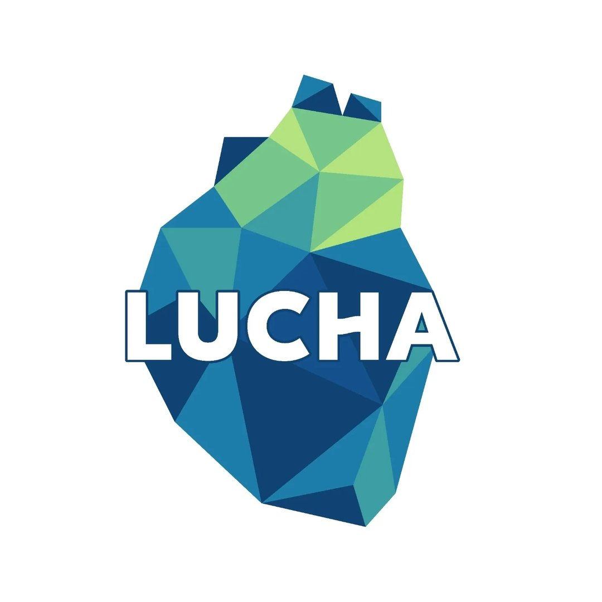

<h2>Lucha</h2>

<strong>Empresas en las que el planeta invertiría.</strong> 
Construimos los agentes y automatizaciones que sostienen la operación de Lucha y de su ecosistema de founders.

<a href="https://www.luchala.org">luchala.org</a>

---

### Qué construimos

Agentes de IA que trabajan junto al equipo en los canales donde ya ocurre el trabajo: WhatsApp, Slack, correo y Notion. Registran, ordenan y proponen, para que las personas dediquen su tiempo a los founders y no a la operación.

### Cómo construimos

- **Primero a mano, después automatizado.** No automatizamos nada que no se haya hecho y validado manualmente.
- **Servir, no auditar.** Un agente está para ayudar a la persona, no para vigilarla.
- **Funciona cuando se ejecutó.** Algo está listo cuando corrió y se leyó el resultado, no cuando el código se ve bien.
- **Cada dato en su lugar.** Notion es donde las personas trabajan; Supabase es donde los agentes piensan.

### Stack

`n8n` · `Supabase` · `Notion` · `Slack` · `Kapso` · `Google Workspace`

---

  

Lucha, somos todos.

